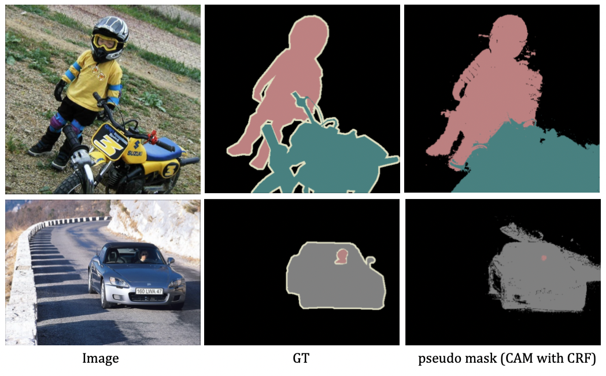

# Implementation of WSSS basic pipeline with PyTorch

This repository contains an implementation of weakly-supervised semantic segmentation using the Pascal VOC 2012 dataset. A Class Activation Map (CAM) based on a ResNet50 (pretrained on ImageNet) with a Conditional Random Field (CRF) is used to generate pseudo masks. The segmentation network is implemented using DeepLabv2 with a ResNet-101 backbone (pretrained on ImageNet).




## Performance

<table>
    <tr>
        <th></th>
        <th>Pseudo Mask &dagger;</th>
        <th>Segmentation Mask &Dagger;</th>
    </tr>
    <tr>
        <td><strong>mIoU</strong></td>
        <td>49.9</td>
        <td>47.5</td>
    </tr>
</table>

&Dagger; Generated through a CRF post-processing of the CAM outputs.<br>
&Dagger; The result of fully-supervised semantic segmentation using the pseudo mask generated from CAM outputs as annotation.


## Setup

### Requirements
```sh
bash install.sh 
```


### Prepare augmented datasets

1. Bring this repository(https://github.com/kazuto1011/deeplab-pytorch) into the `deeplab-pytorch` folder, excluding the files already present in my repository

2. Download pretrained weights from this repository (https://github.com/jbeomlee93/AdvCAM) and locate it on this path ```deeplab-pytorch/data/models/voc12/deeplabv1_resnet101-imagenet.pth```


## Stage1 : Make pseudo mask

### Training
To train CAM based on ResNet50 using only the image-level annotations,
```sh
python main.py --work-dir work_dir/voc/resnet50 --config config/voc/resnet50_cam_m.yaml
```

### Generation
To generate the pseudo masks through CRF post-processing of the CAM outputs, 
```sh
python pseudo_mask_generator.py --config config/voc/resnet50_cam_m_eval.yaml
```

### Evaluation
To evaluate mIoU between original pixcel-level annotation mask and pseudo mask on train set, 
```sh
python pesudo_mask_evaluation.py > pseudo_miou.txt
```


## Stage2 : Do Semantic Segmentation

To train segmentation model with pseudo mask as annotation on train set, and evaluate it on valid set, 

```sh
cd deeplab-pytorch
bash exp.sh
```
